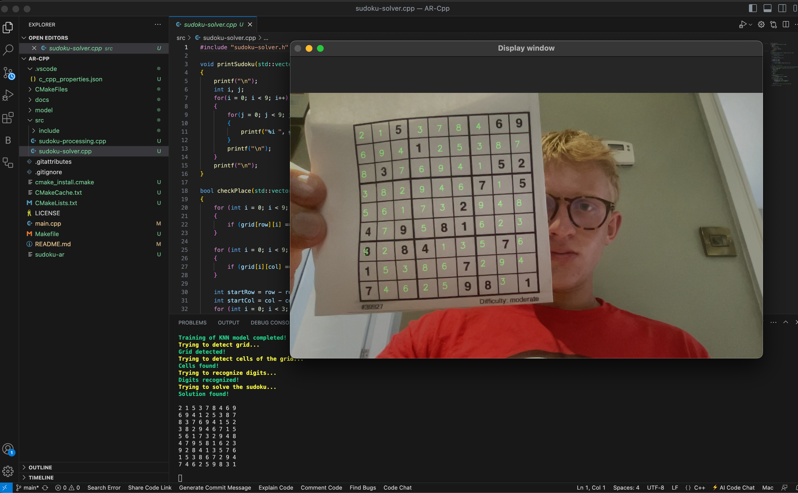

# Sudoku Solver with Augmented Reality

Welcome to the C++ Sudoku Solver using Augmented Reality! This project allows users to capture Sudoku puzzles in real time and solve them instantly using augmented reality.

## Features

- **Augmented Reality Integration:** Capture Sudoku puzzles using a camera and see solutions overlaid in real-time.
- **Fast and Efficient Solving:** Utilizes advanced algorithms for quick and accurate puzzle solving.
- **User-Friendly Interface:** Intuitive controls and display for an enhanced user experience.
- **Cross-Platform Compatibility:** Works on multiple operating systems with the appropriate setup.

## Installation

Follow these steps to set up and run the Sudoku Solver on your machine:

1. **Clone the Repository**
   ```bash
   git clone https://github.com/your-username/sudoku-solver-ar.git
   cd sudoku-solver-ar
   


(Please note this is my first C++ project :) )
